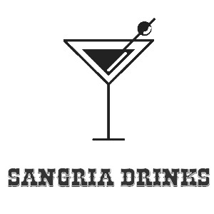

# BEM VINDES AO MEU II PROJETO GUIADO. 

    

Esse projeto foi feito com apoio da professora Hannah na semana 11 da {reprograma}.  A Sangria Drink é uma API 
pensada para verificação de drinks em um estabelecimento. Podemos consultar o nome, ingredientes e valor. Além disso, podem ser consultados todos os aspectos a partir do método **CRUD.**

## OBJETIVO DO DESENVOLVIMENTO

A API foi desenvolvida a partir da necessidade de atualização do cardápio de um bar, visto que, atualmente, o sistema online tem sido adotado por diversos estabelecimentos. Nesse sentido, faz-se importante uma atualização rápida.

## FUNCIONAMENTO DA SANGRIA DRINK

- Através do método **GET** os usuários podem pesquisar informações sobre o drink.
- Com o **POST** poderão ser cadastrados novos drinks.
- Com **DELETE** deletar drinks.
- Com o método **PUT** atualizar um drink por completo.
- E com **PATCH**, atualizar o valor do drink de acordo com a variação de preços dos ingredientes.

## ARQUITETURA E RECURSOS UTILIZADOS;
- A linguagem utilizada: Java Script.
- A arquitetura foi a Model-View-Controller, MVC, que permite a separação do projeto em camadas bem definidas.
- Node Js, API restful, verbos HTTP.
